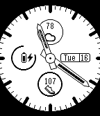

# DIAL_MINUTES

Classic analog dial.  Top ring displays current weather conditions.  Left rign displays battery life and battery icon also reflects battery life.  Charging icon will display to right of battery when charging or connected.  Bluetooth disconnected icon will display when watch is diconnected from phone (also vibrates).  Bottom ring displays percentage of steps to goal of 10000.  Right shows weekday and day of month.  Pushing center button will hide minute and hour hand for 5 seconds.

")
